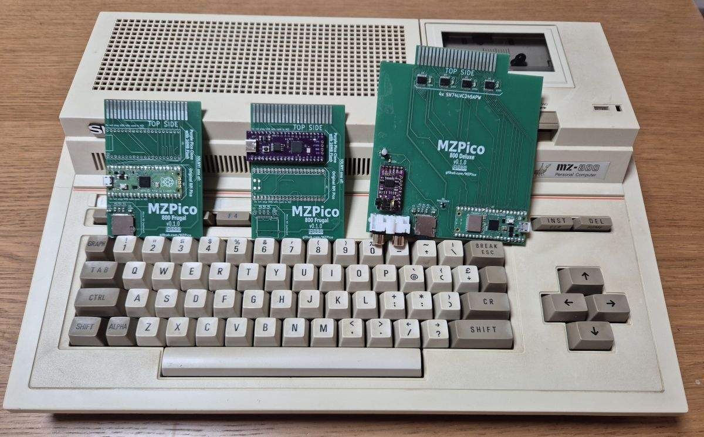
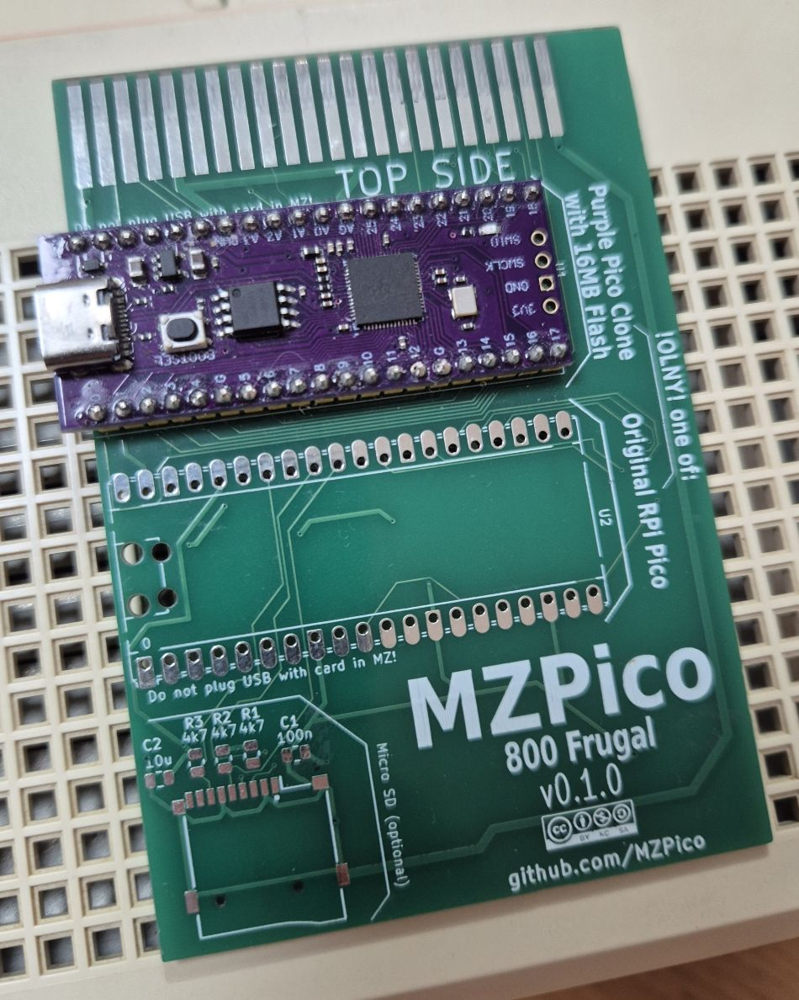
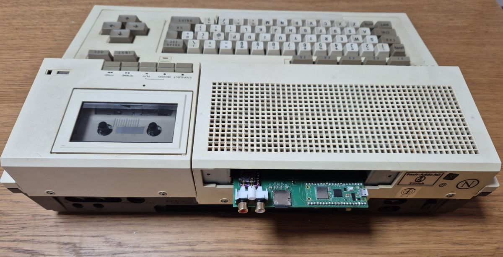
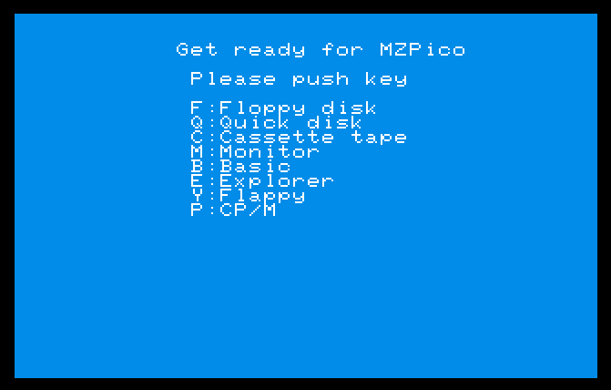
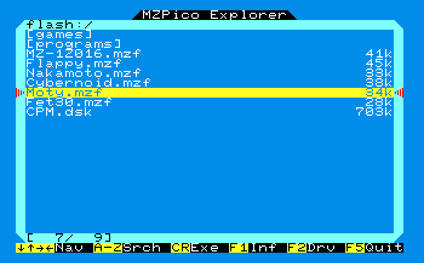

# MZPico Firmware

## What is MZPico?
**MZPico** is a modern replacement firmware and hardware platform for the **Sharp MZ-800**, powered by a **Raspberry Pi Pico**.  
This repository contains the firmware that controls the system.

Related hardware:


| Board | Status | Notes |
|--------|--------|-------|
| [Frugal Board](https://github.com/MZPico/MZPico-800-Frugal-Board) | ✅ Supported | Minimal build with optional MicroSD slot, limited to 8-bit address bus |
| [Deluxe Board](https://github.com/MZPico/MZPico-800-Deluxe-board) | ✅ Supported | Fits MZ-800 upper slot rails, adds level shifters, I2S sound card, Pico access for optional wireless connection |

---

## Features

- **Flexible file storage options**  
  Supports internal flash memory and optional MicroSD cards.

- **Native program execution**  
  Directly loads and runs:
  - `.MZF` (MZ program files)
  - `.DSK` (Floppy images)
  - `.MZQ` (Quick Disk images)

- **Storage device emulation**  
  Emulates multiple virtual devices:
  - Floppy disk controller
  - Quick disk
  - RAM disks

- **User-friendly navigation interface**
  - **Customizable boot screen** with quick access to favorite programs  
    

  - **File explorer** supporting multiple storage devices, directory trees, and fast search  
    

- **Fast system boot via SRAM emulation**
  Allows instant startup on the MZ-800:
  - Boot via port `0xF8` on cold start or reset
  - Startup via port `0xF8` or `0xA8` using the `EB` command at the monitor prompt

- **Highly configurable**
  - Simple **INI-style configuration file**
  - Separate configuration section for each device type
  - Define custom base I/O ports per device
  - Supports multiple instances of the same device (e.g., multiple floppy controllers on different ports)
  - Any device can be enabled/disabled individually  
    → Supports very flexible hardware configurations and avoids conflicts with other expansions

- **Modular firmware architecture**
  Written in modern C++ and structured to make adding new devices and features easy.

- **Easy firmware update**
  - Uses Pico USB mass-storage upload (no special programmer required)
  - Flash and MicroSD contents remain untouched when updating firmware

- **WiFi and cloud storage support** *(Requires Raspberry Pi Pico W)*
  - Connect to WiFi networks
  - Browse and load files from cloud storage
  - Access cloud files as a virtual device `cloud:/`
  - Simple WiFi credential configuration via INI file

---

## Getting Started

1. Download the latest release from the  
   👉 **[Releases page](https://github.com/MZPico/MZPico-firmware/releases)**

2. Choose the correct firmware file:

| Board Type | Pico Model | Flash Size | Firmware File |
|------------|------------|------------|---------------|
| Frugal Board | Pico | 2MB | `mzpico_frugal_2m.uf2` |
| Frugal Board | Pico W (WiFi) | 2MB | `mzpico_frugal_2m_w.uf2` |
| Frugal Board | Purple Pico clone | 16MB | `mzpico_frugal_16m.uf2` |
| Deluxe Board | Pico | 2MB | `mzpico_deluxe_2m.uf2` |
| Deluxe Board | Pico W (WiFi) | 2MB | `mzpico_deluxe_2m_w.uf2` |

> 💡 **Note:** Use the `*_w.uf2` variants when using a Raspberry Pi Pico W to enable WiFi and cloud features.

3. Hold **BOOTSEL** on the Pico and connect to USB.
4. Copy the `.uf2` file to the Pico drive.
5. Upload your Sharp MZ-800 software to the MZPico card using USB mass storage.
6. Insert the card to a Sharp MZ-800 slot, switch it on - done!

---

## Configuration

MZPico uses a simple **INI-style configuration file** (`mzpico.ini`) stored on the root directory of internal flash.  
This file defines which virtual devices are enabled, their I/O base ports, and which storage images they use.

### General rules

- If a section exists in the file, **the device is enabled**  
  (unless the section contains `enabled=false`)
- Multiple instances of the same device type are allowed  
  Example: `[fdc1]`, `[fdc2]`, `[qd1]`, `[qd2]`, etc.
- Each instance must use a **unique not overlapping ports using `base_port`**
- Built-in images can be referenced using `@name`

### Defaults (used when not specified)

| Device      | Default `base_port` |
|-------------|----------------------|
| `sramdisk`  | `0xf8` |
| `qd` (QuickDisk) | `0xf4` |
| `fdc` (Floppy Disk Controller) | `0xd8` |
| `pico_rd` (MZPico-type PicoRD RAM-disk) | `0x45` |
| `pico_mgr` (MZPico management/control device) | `0x40` |
| `psg` (SN76489 PSG) | `0xf2` |

Default `enabled=true` for all devices.

### Built-in images (`@...`)

| Built-in image | Description |
|----------------|-------------|
| `@basic`     | Sharp MZ-800 BASIC with QD and PicoRD support|
| `@menu`      | MZPico boot menu |
| `@explorer`  | MZPico file explorer |

Images can also point to:
- `flash:/filename.ext`
- `sd:/filename.ext`

Supported extensions: `.MZF`, `.DSK`, `.MZQ`

### Menu section

The `[menu]` section configures quick-access programs on the boot menu.

Format:

```
key_<letter>=<display text>|<image or file to execute>
```

Example:

```ini
[menu]
key_b=Basic|@basic
key_e=Explorer|@explorer
key_y=Flappy|flash:/flappy.mzf
key_p=CP/M|flash:/cpm.dsk
```

### Quick disk images

Quick disk emulation can use either a MZQ image file or a direcotory.
Files inside the directory are then served as content of emulated Quick Disk.
The order of files in the Quick Disk is the same their order in the MZPico device filesystem.

Example:
```ini
[qd]
image=sd:/qddir
```

### Example full configuration

```ini
[menu]
key_b=Basic|@basic
key_e=Explorer|@explorer
key_y=Flappy|flash:/flappy.mzf
key_p=CP/M|flash:/cpm.dsk

[sramdisk]
image=@menu

[pico_rd]

[pico_mgr]

[fdc]

[qd]
image=flash:/qd1.mzq

[cloud]
wifi_ssid=MyWiFiNetwork
wifi_password=MyPassword
```

### Notes

- Any device can be disabled using `enabled=false`
- Configuring multiple devices is supported, as long as each has non-conflicting ports
- If a section does **not** exist in the `.ini` file, it will be disabled

---

### PSG (SN76489)

The Programmable Sound Generator (PSG) emulates the Texas Instruments SN76489 used in Sharp MZ-800. It provides 3 tone channels and 1 noise channel, mixed to stereo with per-channel panning.

Config section name: `[psg]`

Defaults:
- `base_port=0xf2`
- `enabled=true`
- `tone0_pan=20`
- `tone1_pan=80`
- `tone2_pan=40`
- `noise_pan=60`
- `volume=20`

Panning keys (0–100):
- `tone0_pan` — left/right balance for tone channel 0
- `tone1_pan` — left/right balance for tone channel 1
- `tone2_pan` — left/right balance for tone channel 2
- `noise_pan` — left/right balance for noise channel

Master volume
- `volume` - volume level, 0-100

Example:

```ini
[psg]
base_port=0xf2
enabled=true
tone0_pan=0
tone1_pan=100
tone2_pan=0
noise_pan=100
volume=60
```

---

## WiFi and Cloud Support

MZPico supports **WiFi connectivity** and **cloud file storage** when using a **Raspberry Pi Pico W** board.

### Requirements

- **Raspberry Pi Pico W** (the wireless variant with built-in WiFi)
- WiFi network with internet access
- Valid WiFi credentials

### Setup

Add a `[cloud]` section to your `mzpico.ini` configuration file with your WiFi credentials:

```ini
[cloud]
wifi_ssid=YourWiFiNetworkName
wifi_password=YourWiFiPassword
```

### Usage

1. Configure WiFi credentials in `mzpico.ini` as shown above
2. Power on your MZ-800 with the MZPico board
3. MZPico will automatically connect to WiFi on startup
4. A new storage device **`cloud:/`** becomes available
5. Use the file explorer or load programs directly from `cloud:/`

### Features

- Browse cloud-hosted MZ-800 software collection
- Load `.MZF` files directly from the cloud
- No local storage required for cloud files
- Automatic connection on startup

---

## Build / Flash (from source)

### Prerequisites

Make sure the following tools are installed on your system:

- `build-essential` (or equivalent compiler tools on your platform)
- `cmake`
- ARM GCC toolchain (`gcc-arm-none-eabi`)
- `z88dk` (used to build the initial MZ-800 SRAM bootstrap code)

> 💡 Tip: On Linux these packages are typically available via the system package manager.  
> On Windows, install using **MSYS2**, **WSL**, or the **Arm GNU Toolchain installer**.

### Clone the repository (with submodules)

```bash
git clone --recurse-submodules https://github.com/MZPico/MZPico-firmware.git
cd MZPico-firmware
```

### Build

Two CMake options must be specified:

| Option | Values | Description |
|--------|--------|-------------|
| `FLASH_SIZE` | `2M` or `16M` | Selects correct firmware for Pico flash size |
| `BOARD` | `FRUGAL` or `DELUXE` | Selects board wiring, available devices, and configuration |

#### Example: Frugal board + original Pico (2MB flash)

```bash
mkdir build && cd build
cmake .. -DFLASH_SIZE=16M -DBOARD=FRUGAL
make
```

#### Example: Deluxe board + purple Pico clone (16MB flash)

```bash
mkdir build && cd build
cmake .. -DFLASH_SIZE=2M -DBOARD=DELUXE
make
```

After build completion, the generated `.uf2` firmware file will appear in the `build` directory.

---

## Limitations

- All emulated MZ-800 devices are read-only. This limitation will be removed in future releases.
- No support yet for I2S card on the DELUXE board.

---

## Credits

The firmware uses code, libraries, or ideas from these excellent projects:

- A8PicoCart https://github.com/robinhedwards/A8PicoCart
- Sharp MZ-800 Emulator by Chaky https://sourceforge.net/projects/mz800emu/
- Sharp MZ-800 Unicard https://sourceforge.net/projects/unicardmk3/
- Atari ST SidecarTridge https://github.com/sidecartridge/atarist-sidecart-raspberry-pico
- no-OS-FatFS-SD-SDIO-SPI-RPi-Pico https://github.com/carlk3/no-OS-FatFS-SD-SDIO-SPI-RPi-Pico
- Iniparser https://gitlab.com/iniparser/iniparser
- Raspberry Pico SDK https://github.com/raspberrypi/pico-sdk
