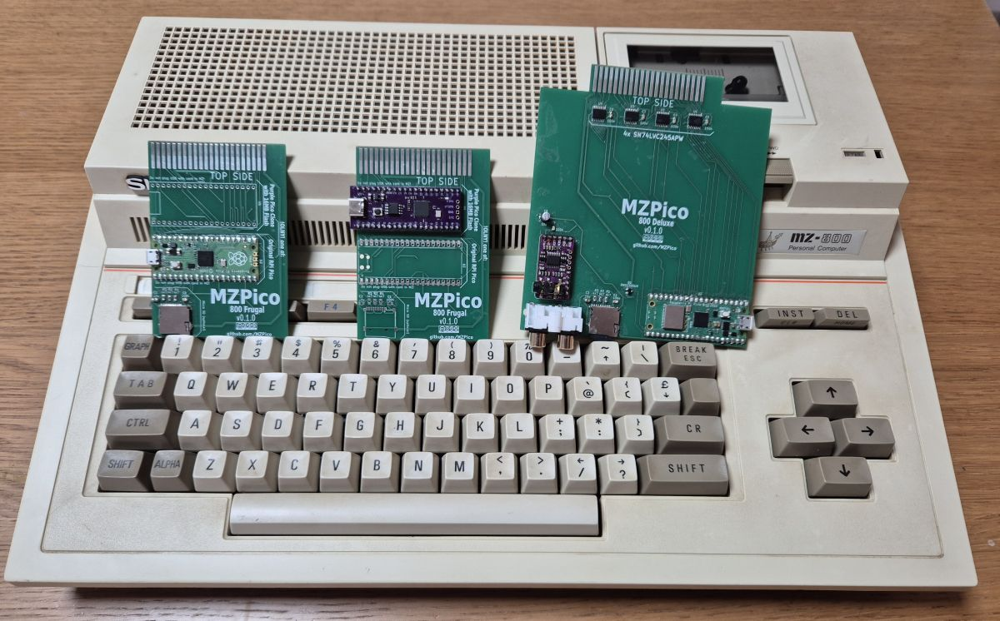
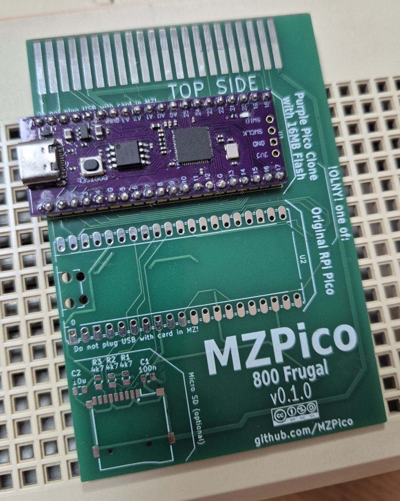
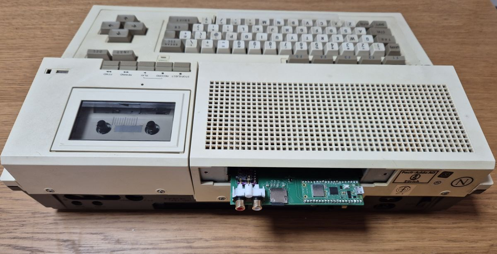
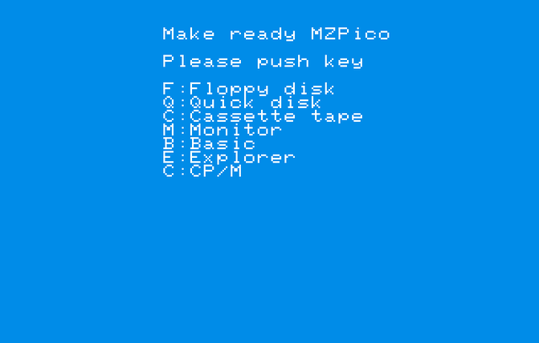
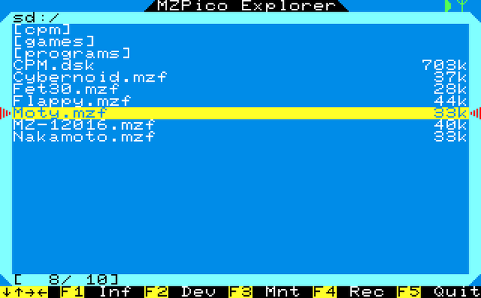

# MZPico Firmware

## What is MZPico?
**MZPico** is a modern replacement firmware and hardware platform for the **Sharp MZ-800**, powered by a **Raspberry Pi Pico**.  
This repository contains the firmware that controls the system.

Related hardware:


| Board | Status | Notes |
|--------|--------|-------|
| [Frugal Board](https://github.com/MZPico/MZPico-800-Frugal-Board) | ✅ Supported | Minimal build with optional MicroSD slot, limited to 8-bit address bus |
| [Deluxe Board](https://github.com/MZPico/MZPico-800-Deluxe-board) | ✅ Supported | Fits MZ-800 upper slot rails, adds level shifters, I2S sound card, Pico access for optional wireless connection |

---

## Features

- **Flexible file storage options**  
  Supports internal flash memory and optional MicroSD cards.

- **Native program execution**  
  Directly loads and runs:
  - `.MZF` (MZ program files)
  - `.DSK` (Floppy images)
  - `.MZQ` (Quick Disk images)

- **Storage device emulation**  
  Emulates multiple virtual devices:
  - Floppy disk controller
  - Quick disk
  - RAM disks (SRAM boot disk, paged RAM disk, PicoRD)

- **Sound emulation over I2S** *(Deluxe board)*  
  Both MZ-800 sound sources are rendered to the on-board I2S sound card:
  - **SN76489 PSG** — 3 tone channels + noise, stereo panning
  - **8253 beeper** — monitor beeps, MZ-700 melody and S-BASIC `MUSIC`, and 1-bit "beeper engine" music in games; both the I/O-mapped and the memory-mapped 8253 access paths are captured

- **User-friendly navigation interface**
  - **Customizable boot screen** with quick access to favorite programs  
    

  - **File explorer** supporting multiple storage devices, directory trees, and fast search  
    

- **Fast system boot via SRAM emulation**
  Allows instant startup on the MZ-800:
  - Boot via port `0xF8` on cold start or reset
  - Startup via port `0xF8` or `0xA8` using the `EB` command at the monitor prompt

- **Highly configurable**
  - Simple **INI-style configuration file**
  - Separate configuration section for each device type
  - Define custom base I/O ports per device
  - Supports multiple instances of the same device (e.g., multiple floppy controllers on different ports)
  - Any device can be enabled/disabled individually  
    → Supports very flexible hardware configurations and avoids conflicts with other expansions

- **Modular firmware architecture**
  Written in modern C++ and structured to make adding new devices and features easy.

- **Easy firmware update**
  - Uses Pico USB mass-storage upload (no special programmer required)
  - Flash and MicroSD contents remain untouched when updating firmware

- **WiFi and cloud storage support** *(Requires Raspberry Pi Pico W)*
  - Connect to WiFi networks
  - Browse and load files from cloud storage
  - Access cloud files as a virtual device `cloud:/`
  - Simple WiFi credential configuration via INI file

---

## Getting Started

1. Download the latest release from the  
   👉 **[Releases page](https://github.com/MZPico/MZPico-firmware/releases)**

2. Choose the correct firmware file:

| Board Type | Pico Model | Flash Size | Firmware File |
|------------|------------|------------|---------------|
| Frugal Board | Pico | 2MB | `mzpico_frugal_2m.uf2` |
| Frugal Board | Pico W (WiFi) | 2MB | `mzpico_frugal_2m_w.uf2` |
| Frugal Board | Purple Pico clone | 16MB | `mzpico_frugal_16m.uf2` |
| Deluxe Board | Pico | 2MB | `mzpico_deluxe_2m.uf2` |
| Deluxe Board | Pico W (WiFi) | 2MB | `mzpico_deluxe_2m_w.uf2` |

> 💡 **Note:** Use the `*_w.uf2` variants when using a Raspberry Pi Pico W to enable WiFi and cloud features.

3. Hold **BOOTSEL** on the Pico and connect to USB.
4. Copy the `.uf2` file to the Pico drive.
5. Upload your Sharp MZ-800 software to the MZPico card using USB mass storage.
6. Insert the card to a Sharp MZ-800 slot, switch it on - done!

---

## Configuration

MZPico uses a simple **INI-style configuration file** (`mzpico.ini`) stored on the root directory of internal flash.  
This file defines which virtual devices are enabled, their I/O base ports, and which storage images they use.

### General rules

- If a section exists in the file, **the device is enabled**  
  (unless the section contains `enabled=false`)
- Multiple instances of the same device type are allowed  
  Example: `[fdc1]`, `[fdc2]`, `[qd1]`, `[qd2]`, etc.
- Each instance must use a **unique not overlapping ports using `base_port`**
- Built-in images can be referenced using `@name`

### Defaults (used when not specified)

| Device      | Default `base_port` |
|-------------|----------------------|
| `sramdisk`  | `0xf8` |
| `qd` (QuickDisk) | `0xf4` |
| `fdc` (Floppy Disk Controller) | `0xd8` |
| `pico_rd` (MZPico-type PicoRD RAM-disk) | `0x45` |
| `pico_mgr` (MZPico management/control device) | `0x40` |
| `psg` (SN76489 PSG) | `0xf2` |
| `ramdisk` (paged RAM disk) | `0xe9` (reset port fixed at `0xf8`) |
| `ctc` (8253 beeper) | fixed system ports (`base_port` not applicable) |

Default `enabled=true` for all devices.

### Built-in images (`@...`)

| Built-in image | Description |
|----------------|-------------|
| `@basic`     | Sharp MZ-800 BASIC with QD and PicoRD support|
| `@menu`      | MZPico boot menu |
| `@explorer`  | MZPico file explorer |

Images can also point to:
- `flash:/filename.ext`
- `sd:/filename.ext`

Supported extensions: `.MZF`, `.DSK`, `.MZQ`

### Menu section

The `[menu]` section configures quick-access programs on the boot menu.

Format:

```
key_<letter>=<display text>|<image or file to execute>
```

Example:

```ini
[menu]
key_b=Basic|@basic
key_e=Explorer|@explorer
key_y=Flappy|flash:/flappy.mzf
key_p=CP/M|flash:/cpm.dsk
```

### Quick disk images

Quick disk emulation can use either a MZQ image file or a directory.
MZF files inside the directory (other files are ignored) are then served as
the content of the emulated Quick Disk. The order of files in the Quick Disk
is the same as their order in the MZPico device filesystem.

Directory-backed Quick Disks are fully writable: saving from the MZ-800
creates a real `.mzf` file in the directory (the filename is taken from the
saved Sharp file name, converted to ASCII; saving an existing name
overwrites that file), and formatting the Quick Disk deletes all MZF files
in the directory. An MZQ image is written in place. Either mount type
becomes read-only when `write_protected` is set; an MZQ image is also
protected by its FAT read-only attribute.

Options:
- `image` — MZQ file or directory
- `write_protected` — `true`/`false` (default `false`)

Example:
```ini
[qd]
image=sd:/qddir
```

### Floppy disk controller

The `[fdc]` section emulates the MZ-800 floppy disk controller with up to 4 drives. Each drive is assigned a `.DSK` image:

```ini
[fdc]
image_disk1=flash:/cpm.dsk
image_disk2=sd:/games.dsk
write_protected=false     ; default for all drives
write_protected1=true     ; per-drive override (1..4, matches image_disk1..4)
```

Sector reads and writes, multi-sector transfers, track formatting
(WRITE TRACK) and the READ TRACK verify pass are supported; formatting
rebuilds the DSK image in place and can create a fresh disk from an
empty image file.
A write-protected drive rejects write commands and reports the WD1793
write-protect status bit to the host, like a disk with the notch covered.
`write_protected` sets the default for all four drives and
`write_protected<N>` overrides it per drive. A drive also becomes
write-protected automatically when its image file has the FAT read-only
attribute set or sits on a write-protected medium.

### Example full configuration

```ini
[menu]
key_b=Basic|@basic
key_e=Explorer|@explorer
key_y=Flappy|flash:/flappy.mzf
key_p=CP/M|flash:/cpm.dsk

[sramdisk]
image=@menu

[pico_rd]

[pico_mgr]

[fdc]

[qd]
image=flash:/qd1.mzq

[cloud]
wifi_ssid=MyWiFiNetwork
wifi_password=MyPassword
```

### Notes

- Any device can be disabled using `enabled=false`
- Configuring multiple devices is supported, as long as each has non-conflicting ports
- If a section does **not** exist in the `.ini` file, it will be disabled
- Keep a copy of `mzpico.ini` on the SD card: if the internal flash ever
  fails to mount, an SD-based config lets the MZPico boot with flash
  unavailable instead of halting
- The internal `flash:` storage is best for images that change rarely.
  Bulk-write workloads (e.g. formatting a floppy image) are inherently
  several times slower on `flash:` than on `sd:` — prefer the SD card for
  working disks
- The internal flash filesystem is protected against power loss during
  writes (double-buffered metadata). Volumes created by older firmware
  keep working but lack this protection; back up the files and reformat
  (e.g. with the `mzpico_format` UF2) to upgrade. A damaged flash volume
  is never reformatted automatically — over USB it shows as "no medium"

---

### PSG (SN76489)

The Programmable Sound Generator (PSG) emulates the Texas Instruments SN76489 used in Sharp MZ-800. It provides 3 tone channels and 1 noise channel, mixed to stereo with per-channel panning.

Config section name: `[psg]`

Defaults:
- `base_port=0xf2`
- `enabled=true`
- `tone0_pan=20`
- `tone1_pan=80`
- `tone2_pan=40`
- `noise_pan=60`
- `volume=20`

Panning keys (0–100):
- `tone0_pan` — left/right balance for tone channel 0
- `tone1_pan` — left/right balance for tone channel 1
- `tone2_pan` — left/right balance for tone channel 2
- `noise_pan` — left/right balance for noise channel

Master volume
- `volume` - volume level, 0-100

Example:

```ini
[psg]
base_port=0xf2
enabled=true
tone0_pan=0
tone1_pan=100
tone2_pan=0
noise_pan=100
volume=60
```

---

### CTC (8253 beeper)

Emulates the MZ-800 built-in beeper — the 8253 counter 0 with its gate latch and the 8255 audio mask — rendered to the I2S output on the Deluxe board. Both hardware access paths are captured:

- the **I/O-mapped** ports used in MZ-800 mode (`0xd0`–`0xd7`)
- the **memory-mapped** window at `0xE004`–`0xE008`, used by MZ-700-mode software and many games (captured by snooping memory writes on the bus, with bank-switch tracking so RAM banked over the window never produces sound)

This covers monitor beeps, S-BASIC `MUSIC`, MZ-700 melody, chip-music engines, and 1-bit "beeper engine" sound in games (e.g. ZX Spectrum ports), reproduced with microsecond event timing.

Config section name: `[ctc]`

Defaults:
- `enabled=true`
- `volume=20` (matches the PSG default, so both sources are balanced)
- `pan=50`

Ports are fixed system addresses; `base_port` does not apply.

Example:

```ini
[ctc]
volume=20
pan=50
```

> 💡 **Note:** the power-on beep right after reset plays before MZPico's audio pipeline has started; it is heard only from the machine's internal speaker.

---

### RAM disk (paged)

The `[ramdisk]` section emulates a paged RAM disk: 64 KB pages selected via the page register, byte access with auto-increment, and full 16-bit intra-page addressing on writes (Deluxe board). Backed by Pico RAM, or by a file for persistent content.

Config section name: `[ramdisk]`

Options:
- `base_port` — default `0xe9` (the reset port stays fixed at `0xf8`)
- `size` — capacity in bytes, rounded up to 64 KB multiples; default `65536` (one page). **Use `131072` or more to enable page switching** — with a single page, page selects wrap back to page 0.
- `image` — optional backing file; omitted = volatile RAM
- `read_only` — `true`/`false` (default `false`)

Example:

```ini
[ramdisk]
size=131072
```

---

### SRAM disk

The `[sramdisk]` section emulates the SRAM boot card used for instant startup (see *Fast system boot*). It serves an `.MZF` program in the SRAM card boot format.

Config section name: `[sramdisk]`

Options:
- `image` — `.MZF` file or built-in image; default `@menu`
- `allow_boot` — answer the boot probe (default `true`)
- `read_only` — default `true`
- `in_ram` — copy the image to RAM for writability (default `false`)
- `size` — override size in bytes

Example:

```ini
[sramdisk]
image=@menu
```

---

## WiFi and Cloud Support

MZPico supports **WiFi connectivity** and **cloud file storage** when using a **Raspberry Pi Pico W** board.

### Requirements

- **Raspberry Pi Pico W** (the wireless variant with built-in WiFi)
- WiFi network with internet access
- Valid WiFi credentials

### Setup

Add a `[cloud]` section to your `mzpico.ini` configuration file with your WiFi credentials:

```ini
[cloud]
wifi_ssid=YourWiFiNetworkName
wifi_password=YourWiFiPassword
```

### Usage

1. Configure WiFi credentials in `mzpico.ini` as shown above
2. Power on your MZ-800 with the MZPico board
3. MZPico will automatically connect to WiFi on startup
4. A new storage device **`cloud:/`** becomes available
5. Use the file explorer or load programs directly from `cloud:/`

### Features

- Browse cloud-hosted MZ-800 software collection
- Load `.MZF` files directly from the cloud
- No local storage required for cloud files
- Automatic connection on startup

---

## Build / Flash (from source)

### Prerequisites

Make sure the following tools are installed on your system:

- `build-essential` (or equivalent compiler tools on your platform)
- `cmake`
- ARM GCC toolchain (`gcc-arm-none-eabi`)
- `z88dk` (used to build the initial MZ-800 SRAM bootstrap code)

> ⚠️ **Pin your z88dk version.** The z88dk snap tracks the auto-updating `latest/edge`
> channel, and library behavior (e.g. keyboard mappings) changes between versions.
> Hold it with `sudo snap refresh z88dk --hold`. Note also that the embedded
> menu/explorer only rebuild when their sources change — after a z88dk update,
> use a fresh build directory to make sure the Z80-side binaries are rebuilt.

> 💡 Tip: On Linux these packages are typically available via the system package manager.  
> On Windows, install using **MSYS2**, **WSL**, or the **Arm GNU Toolchain installer**.

### Clone the repository (with submodules)

```bash
git clone --recurse-submodules https://github.com/MZPico/MZPico-firmware.git
cd MZPico-firmware
```

### Build

Two CMake options must be specified:

| Option | Values | Description |
|--------|--------|-------------|
| `FLASH_SIZE` | `2M` or `16M` | Selects correct firmware for Pico flash size |
| `BOARD` | `FRUGAL` or `DELUXE` | Selects board wiring, available devices, and configuration |

#### Example: Frugal board + original Pico (2MB flash)

```bash
mkdir build && cd build
cmake .. -DFLASH_SIZE=16M -DBOARD=FRUGAL
make
```

#### Example: Deluxe board + purple Pico clone (16MB flash)

```bash
mkdir build && cd build
cmake .. -DFLASH_SIZE=2M -DBOARD=DELUXE
make
```

After build completion, the generated `.uf2` firmware file will appear in the `build` directory.

---

## Limitations

- Floppy disk write support is still limited; Quick Disk and the RAM disks are writable (see the `write_protected` / `read_only` options).
- Sound emulation (PSG + 8253 beeper) requires the Deluxe board's I2S sound card.
- The power-on beep right after reset is heard only from the machine's internal speaker (it plays before MZPico's audio pipeline has started).

---

## Credits

The firmware uses code, libraries, or ideas from these excellent projects:

- A8PicoCart https://github.com/robinhedwards/A8PicoCart
- Sharp MZ-800 Emulator by Chaky https://sourceforge.net/projects/mz800emu/
- Sharp MZ-800 Unicard https://sourceforge.net/projects/unicardmk3/
- Atari ST SidecarTridge https://github.com/sidecartridge/atarist-sidecart-raspberry-pico
- no-OS-FatFS-SD-SDIO-SPI-RPi-Pico https://github.com/carlk3/no-OS-FatFS-SD-SDIO-SPI-RPi-Pico
- Iniparser https://gitlab.com/iniparser/iniparser
- Raspberry Pico SDK https://github.com/raspberrypi/pico-sdk
